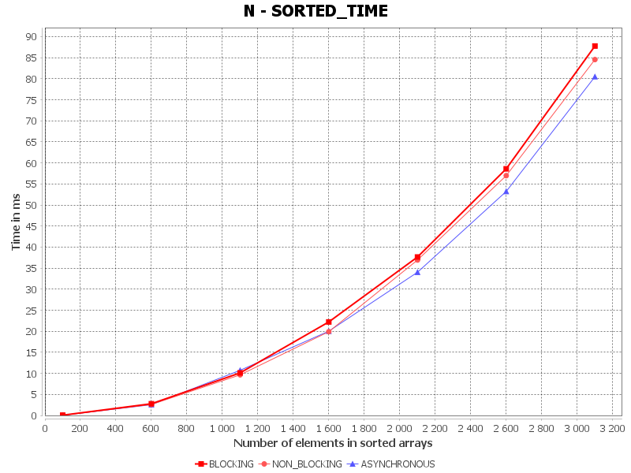
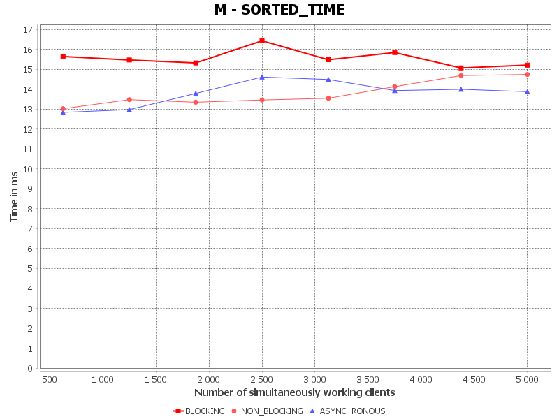
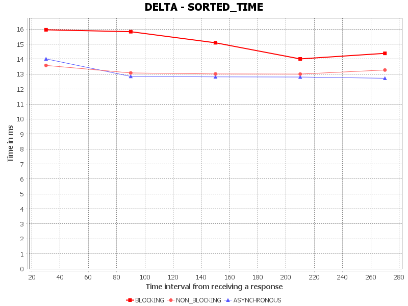
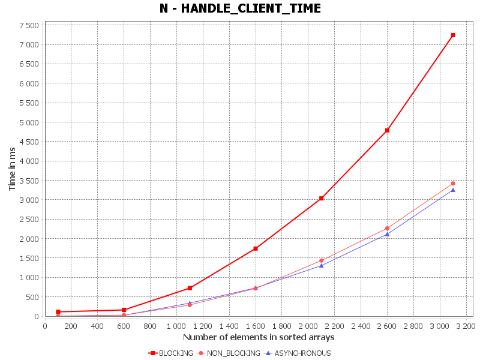
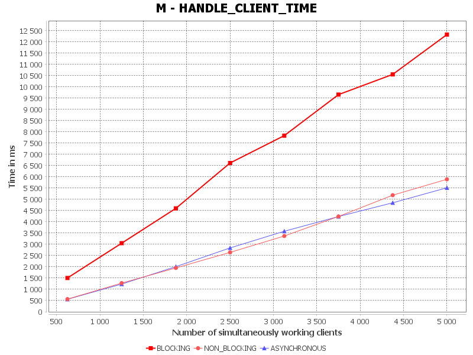
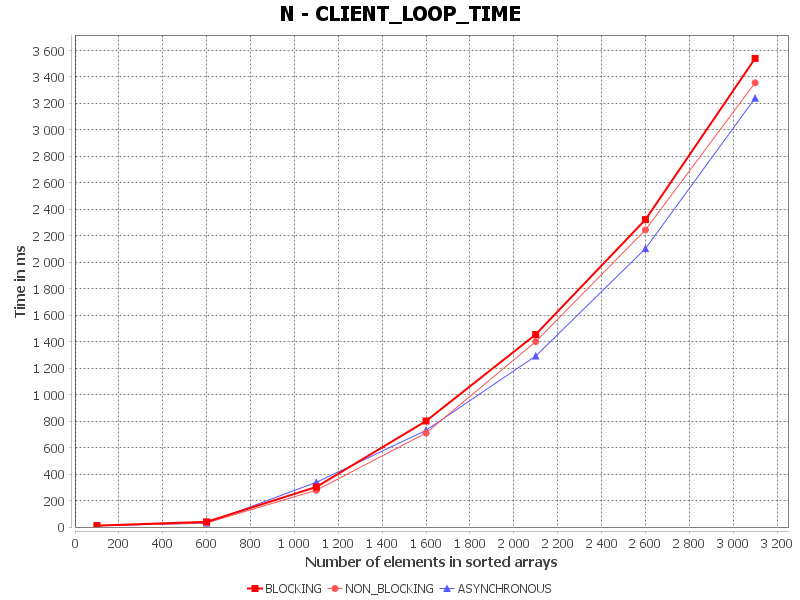

# Testing Server Architectures

## Как пользоваться

В модуле `application` лежит приложение, которое позволяет читать все файлы из папки `INPUT` и генерировать результаты в папку `RESULTS`. \
Программа будет смотреть только саму папку `INPUT`, поэтому можно создавать подпапки под версии или просто перетащить в подпапки не нужный сейчас инпут.

По итогу в папке `RESULTS` будут лежать `.csv`, чтобы графики мотом можно было прочитать результаты в виде текста, а также `.png`, чтобы увидеть результаты визуально в виде графика.

> **IMPORTANT**: так как по ходу GC не очищается (я добавил в коде просьбу почистить, но вряд ли это даст 100% гарантию), то его очистка может влезать в метрики прошлых замеров и влиять на них. \
> Поэтому советую запускать только по одному файлу.

## Как скомбинировать результаты
В модуле `combinerCharts` есть другое запускаемое приложение, которое позволяет читать все результаты из папки `RESULTS` и строить общие графики объединённых по архитектурам. При поиске графиков оно основывается на папках по пути к файлу (а также оно предполагает, что там будут все 27 нужных результатов).

Результаты уже данного приложения будут сложены в папку: `RESULTS/OVERALL`.

## Про клиента

Клиент реализован с помощью блокирующих операций без доп. потоков, тем самым, если он отослал запрос - то он не будет отсылать новые, пока не получит старый.

## Как считаются метрики

- `SORTED_TIME` - время обработки запроса (сортировки в данном случае) на сервере, ms.
  - до создания нового массива для сортировки;
  - перед переводом отсортированного массива в `Response`.
  
  Тем самым учитывается прям только время сортировки.

- `HANDLE_CLIENT_TIME` - время обработки клиента на сервере, ms.
  - учитывается после полного `read`, но до парсинга из массива байтов в `Request`;
  - перед первым вызовом `write` в любой из архитектур;
  
  Тем самым учитывается только время обработки, учитывая такие особенности, как селекторы или то, что коллбеки выполняются только в одном потоке.

- `CLIENT_LOOP_TIME` - среднее время одного запроса на клиенте, ms. \
  Считается как полный цикл всех итераций на клиенте, а затем вычитается `DELTA * X` и усредняется.

## Анализ результатов

>  Константы:
>
> `N` - количество элементов в сортируемых массивах \
> `M` - количество одновременно работающих клиентов \
> `DELTA` - временной промежуток от получения ответа от сервера на одно сообщение клиента до начала отправки следующего сообщения клиента

>  Метрики:
> 
> `SORTED_TIME` - время обработки запроса (сортировки в данном случае) на сервере, ms \
> `HANDLE_CLIENT_TIME` - время обработки клиента на сервере, ms \
> `CLIENT_LOOP_TIME` - среднее время одного запроса на клиенте, ms

>  Архитектуры:
>
> `ASYNCHRONOUS` - асинхронная архитектура \
> `BLOCKING` - блокирующая архитектура \
> `NON_BLOCKING` - неблокирующая архитектура

### `SORTED_TIME`
Тут сложно как-либо оценивать, потому что, что все параметры не особо меняют эту метрику и она сама по себе не сильно растёт и цифры сортировки сами по себе очень маленькие, чтобы оценивать разницу не как погрешность. \
Но можно заметить, что на блокирующей как будто всё-таки появляется небольшая проблема того, что потоков слишком много и могут происходить свитч контексты между сортировкой, чем больше размер задачи.

### `HANDLE_CLIENT_TIME`
Тут прям заметно, что блокирующая начинает сильно отставать, потому что у нас кучу потоков из-за чего много свитч контекстов.

### `CLIENT_LOOP_TIME`

+ `N`: все архитектуры идут вровень. Возможно если подобрать прям совсем другие параметры, то ситуация изменится. \
       Но в целом наверняка всё упирается в выполнение задач в тред пуле, а мы их добавляем в порядке очереди и выполняются они также. \
       Да и так как кол-во клиентов было зафиксировано, то увеличение размера буферов не имеет никакой разницы вне зависимости от архитектуры.

+ `M`: видно, что асинхронная и неблокирующая на уровне погрешности идут, а вот блокирующая могла побыстрее ответить, потому что мы не зависим от того, что коллбеки выполняются в одном потоке или того, что неизвестно когда итерация по селектору дойдёт до нашего конкретного клиента.

+ `DELTA`: можно заметить, что всем архитектурам становится легче, чем больше дельта между отправками запросов на клиентах. Но блокирующая может быстрее отсылать ответ, потому что снова не нужно итерироваться по селектору или не ждём коллбек.

